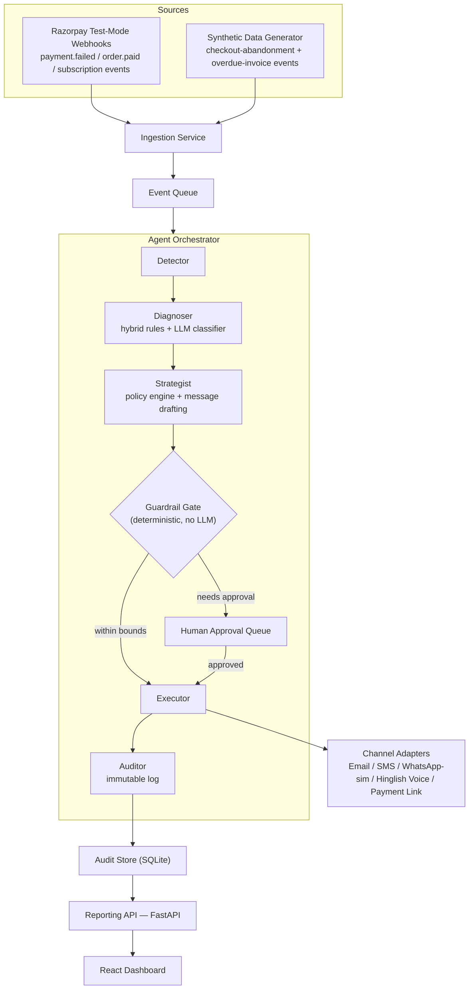

# Recoup — System Architecture

## Overview

Recoup is an autonomous, explainable, compliance-bounded agent that detects revenue leaking
out of a merchant's payment funnel — failed payments, abandoned checkouts, and failed
subscription mandates — diagnoses *why* it's leaking, chooses the right recovery intervention,
executes it through Razorpay's test-mode APIs, and proves in hard numbers how much money it
got back.

## Architecture Diagram

## Services

| Service | Stack | Purpose |
|---|---|---|
| `agent-service` | Python 3.11, FastAPI, LangGraph | Core agent pipeline — detection, diagnosis, recovery |
| `web` | React 18, Vite, TypeScript, Tailwind | Merchant dashboard with decision-trace viewer |
| `data-gen` | Python, Faker | Synthetic event generator for testing |
| `evals` | Python | Offline evaluation harness |
| `ledger-service` | Java 17, Spring Boot *(stretch)* | Double-entry audit ledger |

## Agent Graph Nodes

1. **Detector** — Classifies event type, extracts raw decline reason
2. **Diagnoser** — Hybrid rules+LLM root-cause classifier with confidence scoring
3. **Strategist** — Policy table + LLM message drafting
4. **Guardrail Gate** — Hard-coded compliance checks (no LLM)
5. **Executor** — Channel adapter dispatch with idempotency
6. **Auditor** — Immutable timestamped audit trail
7. **Reporter** — Recovery metrics feed

## LLM Provider Strategy

- **Groq** (primary): Fast inference for latency-sensitive classification + drafting
- **Gemini** (fallback): Backup when Groq rate-limits
- **Audit trail** logs which provider handled each call with latency
