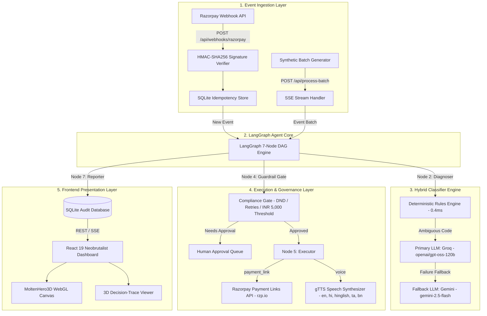
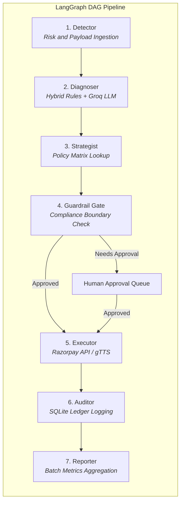
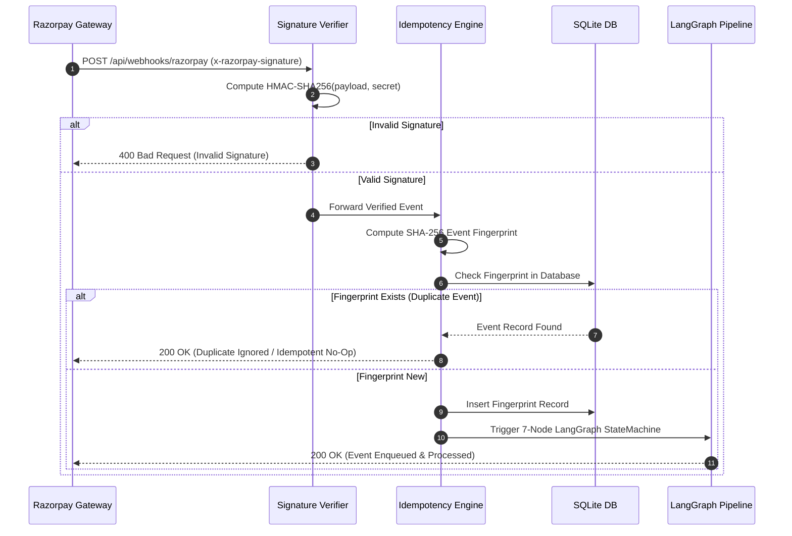

# 🏗 Vaapsi (वापसी) — Technical Architecture Specification

> **"Jo paisa gaya, wapas aayega."**  
> *Autonomous, Explainable, Compliance-Bounded Revenue Recovery Agent for Indian Merchants*

---

## 📑 Table of Contents
- [1. System-Level Architecture](#1-system-level-architecture)
- [2. 7-Node LangGraph State Machine Pipeline](#2-7-node-langgraph-state-machine-pipeline)
- [3. Hybrid Classifier Algorithm Flow](#3-hybrid-classifier-algorithm-flow)
- [4. Webhook Ingestion & Idempotency Pipeline](#4-webhook-ingestion--idempotency-pipeline)
- [5. Component Interactions & Data Schema](#5-component-interactions--data-schema)

---

## 1. System-Level Architecture

Vaapsi operates as a decoupled microservices system consisting of a **FastAPI Agent Service Core**, a **LangGraph StateGraph Execution Engine**, external **LLM Providers (Groq & Gemini)**, **Razorpay Payment API Integration**, **gTTS Multi-Language Speech Synthesis**, and a **React 19 Neobrutalist Web Dashboard**.



---

## 2. 7-Node LangGraph State Machine Pipeline

The agent core is structured as a **LangGraph StateGraph** operating on an immutable `RecoveryCase` state object across 7 sequential execution nodes.



### Pipeline Node Roles:

| Node | Name | Latency Profile | Primary Responsibility |
|---|---|---|---|
| **1** | `Detector` | `<0.1ms` | Ingests event, validates payload, calculates total revenue at risk |
| **2** | `Diagnoser` | `0.4ms` (Rule) / `~1040ms` (LLM) | Classifies root cause using Rules Engine $\rightarrow$ Groq LLM fallback |
| **3** | `Strategist` | `<0.1ms` | Queries deterministic policy matrix for action, channel, and delay hours |
| **4** | `Guardrail Gate` | `<0.1ms` | Enforces DND hours (9 PM–8 AM IST), 3-retry cap, opt-outs, ₹5,000 threshold |
| **5** | `Executor` | `<0.1ms` (or API time) | Creates live Razorpay test payment link (`rzp.io`) or synthesizes gTTS audio |
| **6** | `Auditor` | `<0.1ms` | Appends immutable audit entry to SQLite database |
| **7** | `Reporter` | `<0.1ms` | Aggregates batch metrics and emits Server-Sent Events (SSE) |

---

## 3. Hybrid Classifier Algorithm Flow

Root cause classification combines high-speed deterministic pattern matching with Groq LLM fallback and zero-unknown fallback policy mapping.


---

## 4. Webhook Ingestion & Idempotency Pipeline

To prevent double recovery attempts or duplicate customer contacts from webhook retries, incoming payloads are processed through cryptographic signature verification and SQLite event deduplication.



---

## 5. Component Interactions & Data Schema

### `RecoveryCase` Shared State Schema:

```typescript
interface RecoveryCase {
  case_id: string;                // e.g. "case_c719ce8255aa"
  event_type: string;             // "payment_failed" | "mandate_failed" | "checkout_abandoned"
  decline_reason_raw: string;     // e.g. "DO_NOT_HONOR" | "3DS_TIMEOUT"
  amount_at_risk: number;         // Amount in INR
  currency: string;               // "INR"
  customer_name: string;          // Customer name
  customer_email: string;         // Customer email
  customer_phone: string;         // Customer contact number
  root_cause: string;             // Classified root cause
  root_cause_confidence: number;  // 0.0 - 1.0
  diagnosis_method: "rule" | "llm_fallback";
  diagnosis_provider: string;     // e.g. "groq/openai/gpt-oss-120b"
  diagnosis_latency_ms: number;   // Execution latency in ms
  recovery_channel: string;       // "payment_link" | "voice" | "email" | "sms"
  recovery_action: string;        // "send_payment_link" | "voice_call"
  message_content: string;        // Drafted recovery message
  guardrail_status: "approved" | "blocked" | "pending_approval";
  guardrail_violations: string[]; // Active intervention notes
  execution_status: "success" | "failed";
  execution_result: object;       // Razorpay link ID / gTTS audio payload
  audit_trail: AuditEntry[];      // Full reasoning chain ledger
}
```
