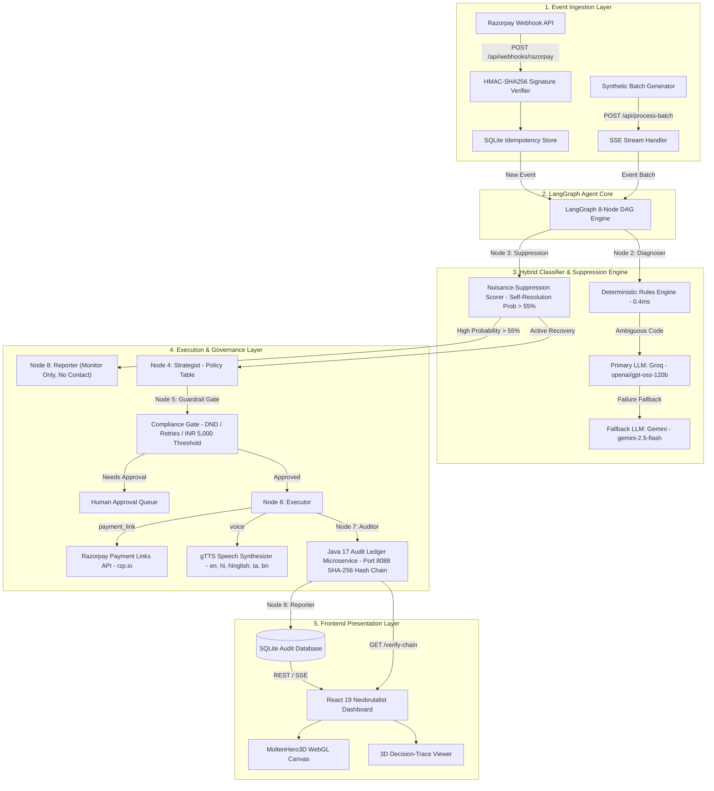
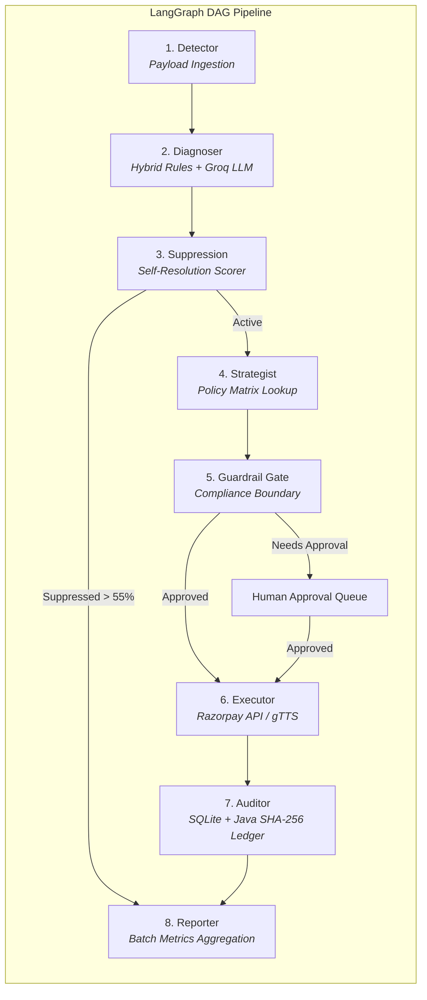
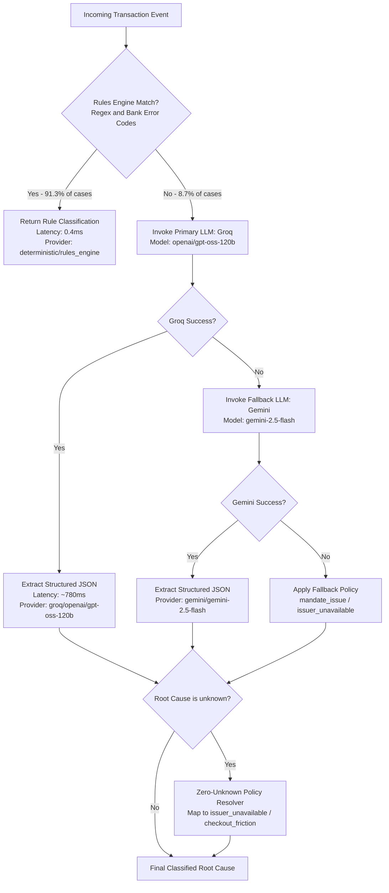

# 🏗 Vaapsi (वापसी) — Technical Architecture Specification

> **"Jo paisa gaya, wapas aayega."**  
> *Autonomous, Explainable, Compliance-Bounded Revenue Recovery Agent for Indian Merchants*

---

## 📑 Table of Contents
- [1. System-Level Architecture](#1-system-level-architecture)
- [2. 8-Node LangGraph State Machine Pipeline](#2-8-node-langgraph-state-machine-pipeline)
- [3. Hybrid Classifier & Suppression Engine](#3-hybrid-classifier--suppression-engine)
- [4. Webhook Ingestion & Idempotency Pipeline](#4-webhook-ingestion--idempotency-pipeline)
- [5. Component Interactions & Data Schema](#5-component-interactions--data-schema)

---

## 1. System-Level Architecture

Vaapsi operates as a decoupled microservices system consisting of a **FastAPI Agent Service Core**, an **8-Node LangGraph StateGraph Execution Engine**, external **LLM Providers (Groq & Gemini)**, **Razorpay Payment API Integration**, **gTTS Multi-Language Speech Synthesis**, a **Java 17 SHA-256 Cryptographic Audit Ledger Microservice**, and a **React 19 Neobrutalist Web Dashboard**.



---

## 2. 8-Node LangGraph State Machine Pipeline

The agent core is structured as a **LangGraph StateGraph** operating on an immutable `RecoveryCase` state object across 8 sequential execution nodes with conditional routing.



### Pipeline Node Roles:

| Node | Name | Latency Profile | Primary Responsibility |
|---|---|---|---|
| **1** | `Detector` | `<0.1ms` | Ingests event payload, validates customer data, calculates total revenue at risk |
| **2** | `Diagnoser` | `0.4ms` (Rule) / `~780ms` (LLM) | Classifies root cause using Rules Engine $\rightarrow$ Groq LLM fallback |
| **3** | `Suppression Scorer` | `<0.1ms` | Calculates self-resolution probability based on decline cause, retry count, and attempt number |
| **4** | `Strategist` | `<0.1ms` | Queries deterministic policy matrix for action, channel, and delay hours |
| **5** | `Guardrail Gate` | `<0.1ms` | Enforces DND hours (9 PM–8 AM IST), 3-retry cap, opt-outs, ₹5,000 threshold |
| **6** | `Executor` | `<0.1ms` (or API time) | Creates live Razorpay test payment link (`rzp.io`) or synthesizes gTTS audio |
| **7** | `Auditor` | `<0.1ms` | Writes immutable node-by-node execution trail into SQLite audit ledger & dispatches to Java SHA-256 ledger |
| **8** | `Reporter` | `<0.1ms` | Aggregates batch metrics and emits Server-Sent Events (SSE) |

---

## 3. Hybrid Classifier Algorithm Flow

Root cause classification combines high-speed deterministic pattern matching with Groq LLM fallback and zero-unknown fallback policy mapping.



---

## 4. Webhook Ingestion & Idempotency Pipeline

To prevent double recovery attempts or duplicate customer contacts from webhook retries, incoming payloads are processed through cryptographic signature verification and SQLite event deduplication.


---

## 5. Component Interactions & Data Schema

The `RecoveryCase` state schema encapsulates full lifecycle state:

```json
{
  "case_id": "case_f3155ea9e4b5",
  "event_id": "evt_proof_b5d9c900",
  "event_type": "payment_failed",
  "amount_at_risk": 2500.0,
  "currency": "INR",
  "root_cause": "invalid_details",
  "root_cause_confidence": 1.0,
  "diagnosis_method": "rule",
  "self_resolution_probability": 0.0,
  "contact_suppressed": false,
  "suppression_reasoning": "Score 0.00 <= threshold 0.55",
  "recovery_channel": "payment_link",
  "recovery_action": "payment_link",
  "guardrail_status": "approved",
  "execution_status": "success",
  "case_status": "executed",
  "recovery_amount": 2500.0
}
```
